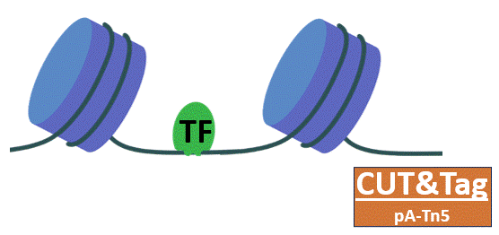
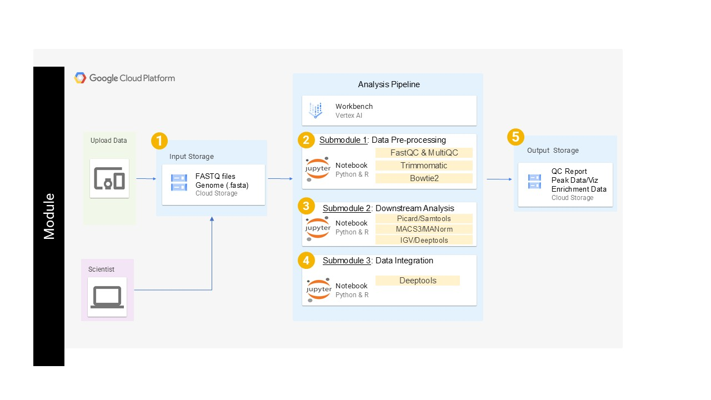

# Exploring Chromatin Occupancy with ChIP-seq, CUT&RUN, or CUT&Tag
---------------------------------

## **Contents**

+ [Overview](#overview)
+ [Background](#background)
+ [Before Starting](#before-starting)
+ [Getting Started](#getting-started)
+ [Software Requirements](#software-requirements)
+ [Architecture Design](#architecture-design)
+ [Data](#data)
+ [Funding](#funding)
+ [License for Data](#license-for-data)

## **Overview**

This module covers the basic analysis and considerations for ChIP-seq, CUT&RUN, and CUT&Tag. Topics include quality control, filtering, alignment, deduplication, peak identification, visualization, and differential analysis of occupancy. Throughout the module, you can explore different considerations for each method as well as unifying themes. This pipeline tutorial is divided into three submodules, which can be taken one after the other, or as standalone lessons covering preprocessing, differential and downstream analysis, and integration of ATAC-seq and RNA-seq. 

https://github.com/user-attachments/assets/9717a9b4-1b7b-4291-ad32-3ad71e259948

## **Background**

There are several reasons to explore the occupancy of proteins on chromatin. ChIP-seq, CUT&RUN, and CUT&Tag represent three high-throughput sequencing approaches to profile chromatin occupancy genome-wide. These approaches have been used to measure histone modifications, RNA polymerases, architectural proteins, and transcription factors, to name a few. These approaches use an antibody to selectively isolate DNA fragments bound by a protein of interest. While these three approaches share some similarities, there are differences that should be taken into consideration when planning experiments and during the analysis of the data. 

### **ChIP-seq**
Most ChIP-seq protocols start with chemical crosslinking (e.g. formaldehyde) to stabilize protein-DNA complexes. Chromatin is then sonicated to produce short fragments from (semi)random breaks. Next, an antibody is used in conjunction with protein A (or G) conjugated beads (usually magnetic) to immunoprecipitate DNA fragments that were bound by the protein of interest. These immunoprecipitates are then de-crosslinked, DNA is purified, and undergoes sequencing library preparation, PCR amplification, and sequencing. 

**Bench Time:** ~ 3-5 days.
**# of Cells:** Typically millions of cells (depending on IP efficiency, protein prevalence, and genome size).
**Sequencing Depth:** Typically 20-40 million reads (depending on genome size).
**Contrast:** Crosslinking allows stopping processes in a fine-scale timing. ChIP-seq has been a tried and tested staple, such that numerous antibodies have been validated specifically for this method.

### **CUT&RUN**
Unlike ChIP-seq, CUT&RUN protocols typically do not include a crosslinking step. While some protocols can include a light crosslinking, the DNA fragments need to be able to diffuse out of the nucleus. In CUT&RUN, cells (or nuclei) are stabilized using concavalin beads, after which an antibody is used to direct protein A (or G) MNase, where it will cut the DNA directly next to the protein of interest. These fragments are collected, and undergo sequencing library preparation, PCR amplification, and sequencing.

**Bench Time:** ~ 1-2 days.
**# of Cells:** Thousands (5,000-500,000) (depending on IP efficiency, protein prevalence, and genome size).
**Sequencing Depth:** Typically 3-10 million reads (depending on genome size).
**Contrast:** Antibodies that have been tested for ChIP-seq, may not always work as efficiently for CUT&RUN.

### **CUT&Tag**
Similar to CUT&RUN, the CUT&Tag method does not include crosslinking. In CUT&Tag, an antibody is used to direct protein A (or G) Tn5, a transposase that inserts short adapters into the DNA directly next to where the protein of interest is bound. This simultaneously fragments the DNA and adds adapters, allowing direct sequencing library preparation by PCR amplification.

**Bench Time:** ~ 1 day.
**# of Cells:** Thousands (<1,000-100,000) (depending on IP efficiency, protein prevalence, and genome size).
**Sequencing Depth:** Typically 3-10 million reads (depending on genome size).
**Contrast:** Antibodies that have been tested for ChIP-seq, may not always work as efficiently for CUT&Tag. CUT&Tag is most commonly used for histone modifications because the salt concentration in CUT&Tag makes it typically less suited for transcription factors. Indeed, adjusting the salt concentration has been puposefully used in [CUTAC](https://elifesciences.org/articles/63274) to profile accessibility near proteins of interest.

### **Analysis**
This module explores the analysis of ChIP-seq, CUT&RUN, and CUT&Tag, including preprocessing, peak identification, visualization of signal, differential analysis, and some aspects of downstream analysis integrating protein occupancy with accessibility from ATAC-seq and differential gene expression from RNA-seq. The differences between ChIP-seq, CUT&RUN, and CUT&Tag can impact choices in the analysis, and we highlight a few throughout the modules. 

## **Before Starting**

These tutorials were designed to be used on cloud computing platforms, such that they require nothing but the files within this GitHub repository along with some downsampled example datasets that are held in cloud storage. Throughout the modules, you will see how to access these example datasets. 

With this in mind, our tutorials use Jupyter Notebook files, which Google Cloud Platform, Amazon Web Services, and Microsoft Azure all provide support for. Therefore, requirements should only require the creation of a virtual machine on one of these providers and the downloading of these repository files to the machine. 

https://github.com/user-attachments/assets/1ec6390c-c7fa-4f26-b123-fb7837f79f3a

## **Getting Started**
This repository contains several notebook files which serve as bioinformatics workflow tutorials that should work on any system that runs jupyter lab, and was specifically designed for Amazon Web Services (AWS) and the Google Cloud Platform (GCP). To learn how to get started with Jupyter Notebooks in the cloud, please follow the instructions provided by the NIH Cloud Lab relevant to your preferred cloud platform: [Jupyter in AWS Sagemaker](https://github.com/STRIDES/NIHCloudLabAWS/blob/main/docs/Jupyter_notebook.md) or [Jupyter in GCP VertexAI](https://github.com/STRIDES/NIHCloudLabGCP/blob/main/docs/vertexai.md). 

To increase the speed of each step, we recommend creating an instance with 50-100 GB of memory and at least 4 cores, for example: ml.c5.xlarge on AWS. 

**Note:** To avoid unintended costs, we also recommend following the instructions to configure the virtual machine to auto-shutdown when left idle: [AWS configuration](https://github.com/STRIDES/NIHCloudLabAWS/blob/main/docs/auto-shutdown-instance.md) and [GCP configuration](https://github.com/STRIDES/NIHCloudLabGCP/blob/main/docs/vertexai.md)

Once you initialize the machine and open jupyter notebook, clone this repository.

After cloning the repository and navigating to the corresponding folder, you will find 3 notebooks, one for each Submodule. To get started, open the notebook corresponding to Submodule 1 and follow the instructions within.

## **Software Requirements**
Because this module is hosted on cloud platforms and implemented in Jupyter Lab, the tools required throughout the module are configured via miniconda. Any system with a bash environment running Jupyter Lab should be able to run the module.

## **Architecture Design**
This module was developed in Jupyter Lab on AWS Sagemaker.

It can also be run in Jupyter Lab on GCP Vertex AI.

Cloning this repository will include all files necessary for the module. Some example data files are found in cloud-based storage, and the instructions on how to access that storage are embedded within the Submodule notebooks. 

## **Data**
This pipeline tutorial will analyze published datasets studying H3K27ac occupancy after aux-mediated degradation of BAF (ChIP-seq), as well as BAF (CUT&RUN) and RNA Polymerase II Ser5ph (CUT&Tag) occupancy after inhibition of transcription elongation using Flavopiridol. As such, this module covers the processing of the data from three distinct but similar methods using downsampled data to improve runtime speed. The original data can be found in the GEO repository with the following accessions: ChIP-seq - GSE173550; CUT&RUN & CUT&Tag - GSE224292. These data were published in the following articles:

Weber CM, et al. mSWI/SNF promotes Polycomb repression both directly and through genome-wide redistribution. Nat Struct Mol Biol. 2021 PMID: [34117481](https://pubmed.ncbi.nlm.nih.gov/34117481/)

Brahma S, Henikoff S. The BAF chromatin remodeler synergizes with RNA polymerase II and transcription factors to evict nucleosomes. Nat Genet. 2024 PMID: [38049663](https://pubmed.ncbi.nlm.nih.gov/38049663/)

**Note:** To allow faster processing we have limited the reads to that of a single chromosome (chr4).

In Submodule 3, we'll be comparing these data to RNA-seq and ATAC-seq in mESCs after BAF inhibition, which was published by Lurlaro M, et al. Mammalian SWI/SNF continuously restores local accessibility to chromatin. Nat Genet. 2021 PMID: [33558757](https://pubmed.ncbi.nlm.nih.gov/33558757/)

## **Funding**
Funded by the INBRE Program (NIH/NIGMS P20 GM103427).

## **License for Data**
Text and materials are licensed under a Creative Commons CC-BY-NC-SA license. The license allows you to copy, remix, and redistribute any of our publicly available materials, under the condition that you attribute the work (details in the license) and do not make profits from it.

This work is licensed under a [Creative Commons Attribution-NonCommercial-ShareAlike 4.0 International License](https://creativecommons.org/licenses/by-nc-sa/4.0/)
